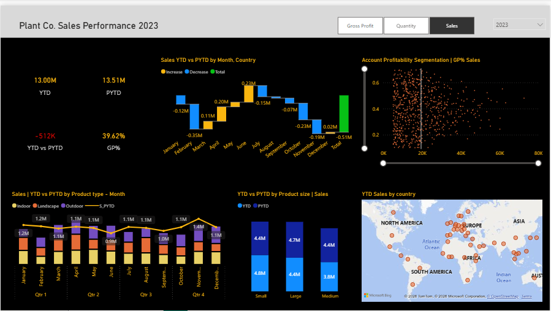
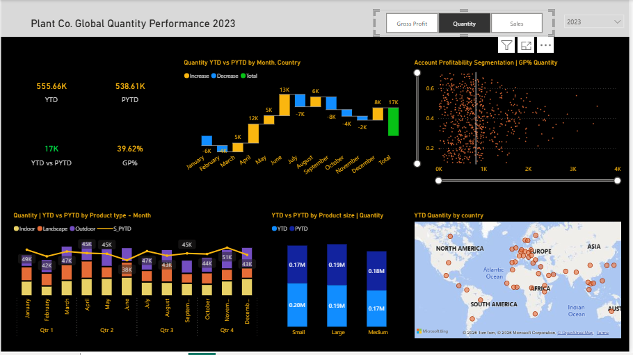
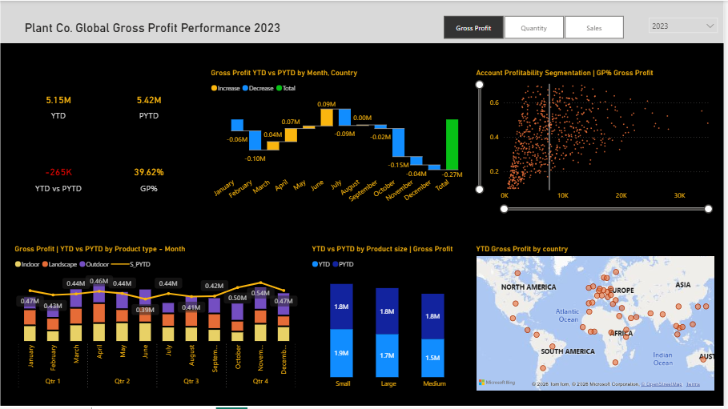

# Plant Co. Global Performance

##   Table of Contents

- [Project brief](#Projectbrief)
- [Data Architecture](#DataArchitecture)
- [Questions](#Questions)
- [Data source](#Datasource)
- [Tools](#Tools)
- [Dashboards](#Dashboard)
- [Chart types and why](#ChartTypesandWhy?)
- [Stages](#Stages)
- [Data Transformation](#DataTransformation)
- [Findings](#Findings)
- [Recommendations](#Recommendations)
- [challenges&solution](#Chalenges&Solution)

## Project brief 

This project features a 3 page, interactive Power BI dashboard designed for Plant Co. to monitor global performance across three key business pillars: Sales, Quantity, and Gross Profit.

The dashboard provides a detailed breakdown experience, allowing stakeholders to identify not just what happened in 2023, but why it happened by comparing Year-to-Date (YTD) performance against the Previous Year (PYTD).

## Data Architecture 

This project is built on a Star Schema architecture, optimized for analytical performance, scalable reporting, and reliable DAX calculations in Power BI.

- Fact Table: contains transactional sales data acting as a central table connecting all business dimensions with key metrics (Quantity, Sales, COGs). 

- Plant_Products Table: This here contains the product attributes and hierarchy to help in analysis with product size, type, group e.t.c

- Accounts Table: Contains customer and account information includes geographic and location for regional a nalysis.

- Calendar Table: Created to help in time intelligence analysis. It helps in calculating YTD, PYTD and SAMEPERIODLASTYEAR.

- Measures Table: This is not connected to other table but used for all DAX measures to help in reusability, readability.

- Slic_Values: This is also diconnected from other tables. It helps in calculating dynamic slicers measures and a conditional measures.Also, this slicers is not connected intentionally as to be flexible.

### Benefit of data modeling

- Improves query performance and report responsiveness

- Simplifies DAX logic by enforcing a single-direction filter flow

- Ensures accurate time-intelligence calculations

- Follows industry best practices for Power BI and enterprise BI solutions.

## Questions
 Overall Performance & Growth: Is Plant Co. growing or shrinking?

- How did our 2023 YTD Sales perform compared to the same period last year?What is the exact dollar value of our performance gap?

- Are we selling more but making less? Is our Gross Profit margin of stable, or has it eroded since the previous year?

- Which customers are our Whales (High Volume/High Profit versus our Resource Drainers (High Volume/Low Profit)?

- Which accounts are falling below our profitability threshold?

- Which product segment is responsible for the largest profit decline?

- We sold 17K more units this year—why didn't our revenue increase accordingly?

- Which global regions are currently our strongest growth engines?

- In which specific months did we lose our momentum?

## Data Source

## Tools

| Tools | Purpose | 
| --- | --- | 
| Power BI | DAX, Power Query | 

## Stages 
- Load data to Power Query, Standardize data-types and remove duplicates.
- Create a 'calendar' table and toggle button to view across 3 pillars of business. (Quantity, Sales and Gross Profit).
- Data modeling. Create DAX measures. 

## Chart types and Why? 

- Card Visuals - Shows the KPIs metrics (YTD, PYTD and GP%), and also the dynamic report title.

- Scatter Charts - Shows accouint segmentation by GP % vs Sales. This allows stakeholders to identify high-volume, low-margin "risk" accounts versus high-margin "premium" accounts.

- Waterfall charts - Shows the "YTD vs PYTD" comparison by Month, to provide a clear narrative of seasonal fluctuations.

- Map - Shows the global YTD Sales, Quantity and GP %  by country, providing a spatial understanding of the company's market footprint.

- Stacked Bar chart - Helps show the break down performance by product type (Indoor, Landscape, Outdoor).

- Column chart - Display the breakdown performance by Product Size (Small, Medium, Large)

## Dashboard
 
 This dashboard allows the Sales Director to pivot from 'General Observation' to 'Targeted Action' for example, specifically investigating the November slump or renegotiating low-margin accounts identified in the scatter plot.

## Data Transformation

Here are the DAX formulas used in this project:

- Sales = SUM('Fact'[Sales_USD])
        - This measure total all sales values from the Fact table.  

- Qty = SUM('Fact'[Quantity])
        - This measure total all quantity from the Fact table.

- COGs = SUM('Fact'[COGS_USD])
        - This measure total the Cost of Good sold from the Fact table  

- GrossProfit = COGs - Sales
        - This measure subtract the COGs from Sales to get the Gross Profit.

- YTD Sales = TOTALYTD('Measures'[Sales], 'Calendar'[Date]) 
        - This measure is used to calculate the YTD sales, quantity, and gross profit from the start of the year to the end. 

- PYTD Sales = CALCULATE([YTDSales], SAMEPERIODLASTYEAR('Calendar'[Date]))
      - This measure is used to calculate the YoY comparison of sales, quantity, and gross profit. Just as seen in the waterfall chart.

- GP% = DIVIDE([GrossProfit], [Sales])
        - This measure is used to calculate the GP %. 

## Findings

1. Plant Co. achieved a total YTD Sales revenue of $13.00M, which represents a $512K decrease compared to the previous year’s performance of $13.51M.

2. Despite the drop in revenue, the total Quantity sold actually increased by 17K units (556K vs 539K), suggesting a shift toward lower-priced products or a more aggressive discounting strategy.

3. Gross Profit reached $5.15M with a consistent margin of 39.62%, though the total profit dollar value is down by $265K compared to the prior year.

4. The Sales waterfall analysis identifies February and November as the most critical months of decline, where performance significantly deviated from the prior year's trends.

5. Product segmentation reveals that the 'Outdoor' category and 'Large' product sizes are the primary drivers of the year-over-year value gap, whereas 'Indoor' and 'Small' products remain high-volume anchors.

6. The Account Profitability scatter plot indicates a high concentration of accounts below the 40% gross profit threshold, highlighting a major opportunity for margin optimization.

7. Geographical data shows that while sales are distributed globally, the European and North American markets contribute the highest density of transaction volume.

8. The 'Small' product size segment is the volume leader, moving 202K units, yet it does not generate enough revenue to offset the losses seen in the 'Large' product category.

9. There is a clear disconnect between sales activity and profitability in specific mid-tier accounts, where high quantity sold is not translating into proportional gross profit growth.

10. The 2023 fiscal year performance suggests that while market reach is expanding (higher unit sales), the company needs to re-evaluate its pricing architecture to recover lost revenue and profit margins.

## Recommendations

1. Launch a "Premium Recovery" campaign targeting the 'Large' product segment to reclaim the YTD profit deficit identified in the performance waterfall.

2. Conduct a deep-dive pricing audit to determine if the 17K increase in unit volume is being undercut by excessive discounting or "loss leader" pricing strategies.

3. Initiate a sales team review for the month of November to identify external market factors or internal process gaps that led to the significant recurring annual performance dip.

4. Implement a tiered account management strategy that prioritizes the high-volume/high-margin "Whale" accounts identified in the profitability scatter plot.

5. Re-negotiate terms or adjust service levels for accounts currently falling in the "Low-Margin/High-Volume" quadrant to improve overall Gross Profit percentage.

6. Develop a localized marketing push in the European and North American hubs to capitalize on existing high sales density and maximize economies of scale.

7. Perform a "Product Mix Optimization" analysis to transition customers from lower-value 'Small' units into higher-margin 'Medium' or 'Large' alternatives.

8. Establish an automated "Early Warning System" in Power BI that triggers alerts when monthly Gross Profit falls more than 5% below the Prior Year (PYTD) benchmark.

9. Review supply chain and logistics costs associated with 'Outdoor' products to identify if rising operational expenses are the root cause of the profit decline in that category.

10. Schedule quarterly "Profitability Workshops" with the regional sales heads to review the dashboard insights and align on specific targets for the upcoming quarter.

## Challenges & Solution 

1. The stakeholders needed to see Sales, Quantity, and Gross Profit performance, but putting all three on one page created a cluttered and "noisy" dashboard that was hard to read.

    - How I solved it: I created a "Slicer Table" for easy toggling between 3 key pillars of business using DAX. This allowed the user to switch the entire context of the page with one click, maintaining a clean and simple report while providing three times the analytical depth.

2. Standard YTD functions can sometimes fail if the fiscal calendar is non-standard or if there are gaps in the data, leading to misleading variance figures.

    - How I solved it: I created a Date Table and utilized SAMEPERIODLASTYEAR combined with TOTALYTD logic to ensure the waterfall charts accurately show comparisons for the $512K sales variance.

3. With hundreds of accounts, a standard bar chart was insufficient for identifying profitability outliers.

    - How I solved it: I used a Scatter Plot with a Profitability Quadrant. By adding a constant line at the 20K sales mark and a GP% axis, I created an instant visual diagnostic tool to separate "High-Volume/Low-Margin" accounts from "Premium" partners.

